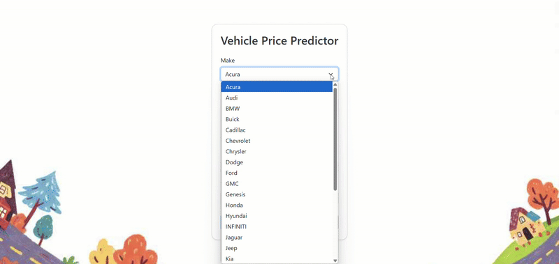

# Vehicle Price Prediction

This project utilizes machine learning techniques to predict vehicle prices based on various features. It includes a trained model, a Flask web application for user interaction, and all necessary components for deployment.

## Features

- **Machine Learning Model**: Trained using a dataset of vehicle features to predict prices accurately.
- **Web Application**: A user-friendly Flask interface for inputting vehicle details and obtaining price predictions.
- **Deployment Ready**: Includes a `Procfile` for easy deployment on platforms like Heroku.

## Project Structure

```
Vehicle-Price-Prediction/
├── app.py
├── dataset.csv
├── ml vehicle.ipynb
├── Predict Vehicle Prices.pdf
├── Procfile
├── requirements.txt
├── static/
├── templates/
├── util.py
├── feature_names.pkl
├── onehot_encoder.pkl
├── standard_scaler.pkl
└── vehicle_price_model.pkl
```

## Installation

1. **Clone the Repository**:
   ```bash
   git clone https://github.com/Hurmath123/Vehicle-Price-Prediction.git
   cd Vehicle-Price-Prediction
   ```

2. **Create a Virtual Environment**:
   ```bash
   python -m venv venv
   source venv/bin/activate  # On Windows: venv\Scripts\activate
   ```

3. **Install Dependencies**:
   ```bash
   pip install -r requirements.txt
   ```

## Usage

1. **Run the Application**:
   ```bash
   python app.py
   ```

2. **Access the Web Interface**:
   Open your browser and navigate to [`https://vehicle-price-prediction-ve02.onrender.com/`] to use the application.

##  Model Training

The `ml vehicle.ipynb` notebook contains the steps for data preprocessing, model training, and evaluation. It utilizes libraries such as `pandas`, `scikit-learn`, and `matplotlib`.

##  Deployment

The project includes a `Procfile` for deployment on Heroku. Ensure that all necessary files are committed, and follow Heroku's deployment guidelines.

##  Resources

- **Dataset**: `dataset.csv` containing vehicle features and prices.
- **Model Artifacts**:
  - `vehicle_price_model.pkl`: Trained machine learning model.
  - `feature_names.pkl`: Feature names used in the model.
  - `onehot_encoder.pkl`: Encoder for categorical variables.
  - `standard_scaler.pkl`: Scaler for numerical features.

## Project Demo



## Author
Frough Hurmath S
**Hurmath123**  
[GitHub Profile](https://github.com/Hurmath123)

---

## License

This project is licensed under the [MIT License](LICENSE).

